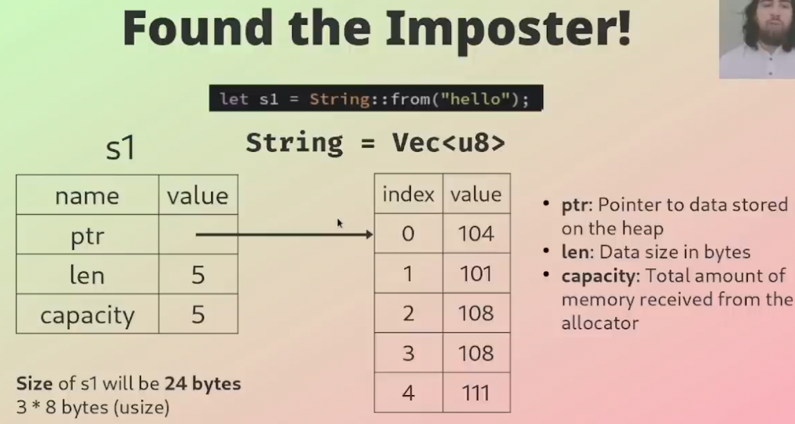

## Vectors

- Vectors are like arrays, but are <b>dynamically sized</b>, meaning they can
  grow and shrink

- Vectors are allocated on the <b>heap</b> as a <b>contiguous</b> block of memory

- All elements within a Vector must have the <b>same type</b>

- Vectors use the special <b>macro</b>: vec!

### Found the Imposter!

