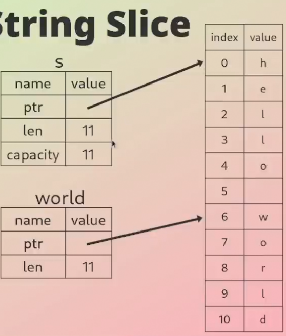

## Compound Types

A compound type is a type which is made up of other types, for example a string
is made up of characters, so it's considered a compound type.

## String vs &str

- A String is a <b>heap-allocated</b> string type that <b>owns</b> its contents
  and is <b>mutable</b>
- A &str is an <b>immutable</b> sequence of UTF-8 bytes in memory, it does
  <b>not own</b> the underlying data and is <b>immutable</b>
- Think of &str as a <b>view</b> on a sequence of characters (stored as UTF-8
  bytes) in memory
- Use &str if you just want to have a view of a string
- &str is more lightweight and efficient than String
- Use String if you need to own the data and be able to mutate it

## String Literal

- A string literal is a <b>sequence of characters</b> enclosed in double quotes
  (")
- A string literal is a fixed size, compile-time known sequence of UTF-8 bytes
- The type is `&'static str`, which indicates the data is stored in <b>static
  storage</b>, meaning it is <b>valid</b> throughout the <b>entire lifetime</b> of
  the program
- The data is <b>hardcoded</b> into the <b>executable</b> and stored in
  <b>read-only memory</b>, meaning they are <b>immutable</b>

## Example String Slice

```rust
let s = String::from("hello world");

let hello = &s[0..5];
let world = &s[6..11];
```

The string slice `world` points to a <b>sequence of characters</b> stored on the
heap


