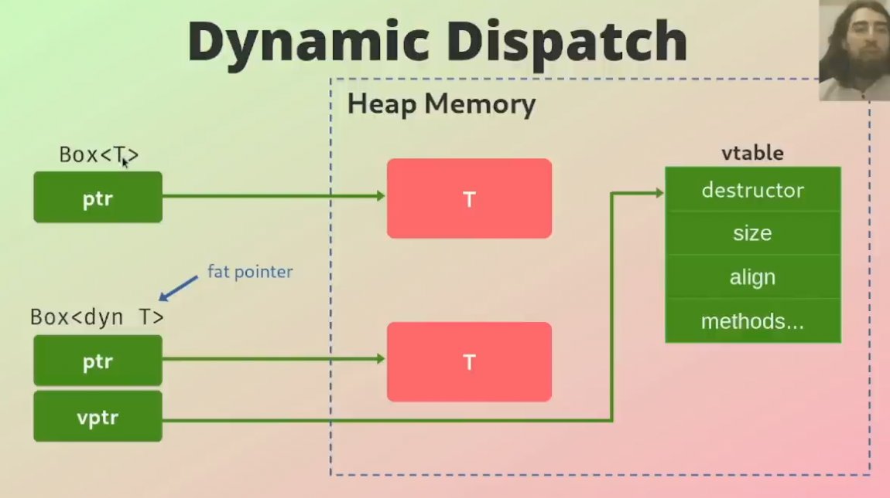

## Traits

- A Trait is a set of <b>methods</b> that can be implemented for <b>multiple
  types</b> in order to provide <b>common functionality</b> and <b>behavior</b>
  between them

- A Trait consists of <b>method signatures</b> only,n which then have to be
  implemented by the target type

- Traits are similar to "classes" in other languages, but are not quite the same though

- Traits define a <b>shared behavior</b> in an abstract way

### Example Trait

```rust
trait Animal {
    fn sound(&self) -> String;
}

struct Sheep;
struct Cow;

impl Animal for Sheep {
    fn sound(&self) -> String {
        String::from("Baah")
    }
}

impl Animal for Cow {
    fn sound(&self) -> String {
        String::from("Mooh")
    }
}
```

The Trait, `Animal`, has one method, `sound()`. In the trait we define <b>only
the signature</b>.

Then we implement this trait <b>for every type</b> we want. Here we copy the
signature and write the actual method.

### Derivable Traits

- A Derivable Trait is a Trait that can be <b>automatically implemented</b> for
  a struct or an enum by the Rust compiler

- Derivable Traits are called "derivable" because they can be <b>derived
  automatically</b>

- The most common derivalbe traits are:

  - <b>Debug</b>: Allowing to output content via "{:?}"
  - <b>Clone</b>: Enables a type to be duplicated with "clone()" method
  - <b>Copy</b>: Enables a type to be copied implicitly, without requiring the
    explicit "clone()" method
  - <b>PartialEq</b>: Enables comparison

### Traits as Parameters

```rust
pub fn notify(item: &impl Summary) {
    println!("Breaking news! {}", item.summarize());
}
```

Traits can be used as <b>parameters</b> for functions.

The function `notify()` takes as an argument any type that has
<b>implemented</b> the `Summary` trait.

### Trait Bounds

```rust
pub fn notify<T: Summary>(item: &T) {
    println!("Breaking news! {}", item.summarize());
}
```

Similar to the previous example using `&impl Summary` but more <b>verbose</b>.
Trait bounds are declared like generics, (i.e. after the name of the function).
Use <b>trait bounds</b> if you have lots of paramters to avoid this.

```rust
pub fn notify(item1: &impl Summary, item2: &impl Summary) {}
// becomes:
pub fn notify<T:Summary>(item1: &T, item2: &T) {}
```

### Where Clauses

```rust
fn some_function<T: Display + Clone, U; Clone + Debug>(t: &T, u: &U) -> i32 {}
```

If you have a function that makes <b>heavy use</b> of trait bounds, we can use a
where clause to make the code cleaner:

```rust
fn some_function<T, U>(t: &T, u: &U) -> i32
where
    T: Display + Clone,
    U: Clone + Debug,
{}
```

### Return Types that Implement Traits

```rust
trait Animal {}

struct Dog;
struct Cat;

impl Animal for Dog {}
impl Animal for Cat {}

fn return_dog() -> impl Animal {
    Dog {}
}

fn return_cat -> impl Animal {
    Cat {}
}

fn main() {
    return_dog();
    return_cat();
}
```

Here w have a <b>trait</b>, `Animal`, which is implemented for two structs, `Dog` and `Cat`.

The two functions return a struct, either `Dog` or `Cat`, that <b>implements</b>
the `Animal` trait.

### Trait Objects

- Using `impl Trait` doesn't work when returning <b>multiple types</b>

- <b>Different implementations</b> of a trait probably use <b>different amounts
  of memory</b>, but sizes of types <b>must be known</b> at compile time

- In this case, <b>trait objects</b> can be used

- A trait object is essentially a <b>pointer</b> to any type that implements the
  given trait, where the precise type can only be known at runtime

### Dynamic Trait Objects

```rust
trait Animal {}

struct Dog;
struct Cat;

impl Animal for Dog {}
impl Animal for Cat {}

fn return_animal(s: &str) -> &dyn Animal {
    match s {
        "dog" => &Dog {},
        "cat" => &Cat {},
        _ => panic!(),
    }
}

fn main() {
    let animal1 = return_animal("cat");
    let animal2 = return_animal("dog");
}
```

Here we have a <b>function</b> which returns a type that <b>implements</b> the
`Animal` trait. This could be `Dog` or `Cat`. As the trait object is behind a
<b>pointer</b>, the <b>size</b> is <b>known</b> at compile time, which is
<b>usize</b> (size of a pointer).

This allows for more <b>flexible</b> code as the <b>exact return type</b>
doesn't have to be known at compile time as long as the <b>size is fixed</b>.

### Static Dispatch

- A Static Dispatch resolves method calls at <b>compile time</b>

- The Rust Compiler <b>generates function code</b> for each concrete type that
  imlements a trait

- A Static Dispatch calls the appropriate function based on <b>concrete
  types</b>

- A Static Dispatch is <b>faster</b> and more <b>efficient</b> than the dynamic
  dispatch, but it doesn't provide great flexibility

### Static Dispatch Example

```rust
trait Animal {
    fn say_hi(&self);
}

struct Dog;
struct Cat;

impl Animal for Dog {
    fn say_hi(&self) {
        println!("Woff");
    }
}

impl Animal for Cat {
    fn say_hi(&self) {
        println!("Meow");
    }
}

fn main() {
    let dog = Dog;
    let cat = Cat;

    dog.say_hi();
    cat.say_hi();
}
```

Is instead represented like so:

```rust
struct Dog;
struct Cat;

impl Dog {
    fn say_hi(&self) {
        println!("Woff");
    }
}

impl Cat {
    fn say_hi(&self) {
        println!("Meow");
    }
}

fn main() {
    let dog = Dog;
    let cat = Cat;

    dog.say_hi();
    cat.say_hi();
}
```

The compiler generates <b>methods</b> for <b>each concrete type</b> (`Dog`, `Cat`) and the called method `say_hi()` can be resolved because it is known which method for which type has to be resolved <b>at compile time</b>.

Note: The output might not actually look like that because the compiler applies
optimizations.

### Dynamic Dispatch

- In Dynamic Dispatch, specific methods to be called is determined at
  <b>runtime</b>

- Dynamic Dispatch works by creating a <b>reference</b> or a <b>smart
  pointer</b> to a trait object using the `&dyn` or `Box<dyn >` syntax

- When a trait object is created, the compiler will build a <b>vtable</b> for
  that trait

- A <b>vtable</b> is a table that contains a <b>pointer</b> to the
  <b>implementation of each method</b> in the trait for the specific type of the
  object that the reference points to

- The Compiler will do a <b>lookup</b> in a <b>vtable</b> to determine which
  method should be calle for which type that implements the given trait

- This lookup will cause <b>overhead</b> but allows for <b>more flexible</b>
  code

  

### Dynamic Dispatch Example

```rust
trait Animal {
    fn noise(&self);
}

struct Cat;
struct Dog;

impl Animal for Cat {
    fn noise(&self) {
        println!("Meow");
    }
}

impl Animal for Dog {
    fn noise(&self) {
        println!("Woff");
    }
}
```

- We have an Animal trait and two structs that implement this trait

- We have a function that takes a random number and returns a type that
  implements the Animal trait (either Cat or Dog)

- The Compiler can not know the size at compile time, as one type might be
  bigger than the other

- Then the `noise()` method gets called on the returned type that imlements the
  Animal trait. Again, the compiler <b>can not know this</b>. this can only be
  resolved at runtime

```rust
fn random_animal(random_number: u8) -> Box<dyn Animal> {
    if random_number < 10 {
        Box::new(Cat {})
    } else {
        Box::new(Dog {})
    }
}

fn main() {
    let random_number = 5;
    let animal = random_animal(random_number);
    animal.noise();
}
```

### Box

- A Box is a <b>smart pointer</b> that allows you to store data on the
  <b>heap</b> rather than the stack

- You should use box when you have a type whose <b>size can't be known at
  compile time</b>

- A Box returns a <b>pointer</b> to the data stored on the <b>heap</b>

### & vs Box (i.e. difference between a Reference and a Box)

- <b>Memory</b>: A Box <b>allocates</b> data on the <b>heap</b> and <b>owns</b>
  it. Box is also responsible for <b>deallocating</b> when the value goes out
  of scope. Reference(`&`) only <b>points</b> to a value <b>already</b> in
  memory

- <b>Lifetime</b>: Box can be passed <b>across scopes</b>, while Reference(`&`)
  has a <b>limited</b> lifetime

- <b>Box</b> can be <b>cloned<b>, while Reference(`&`) cannot

- <b>Box</b> can be used in <b>pattern matching</b>
