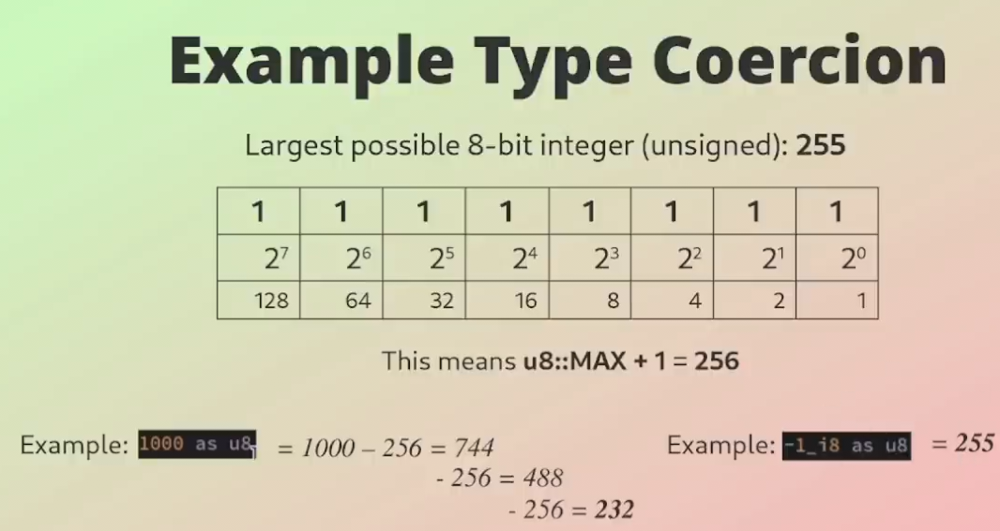

## Type Coercion - as

- Type conversion, also known as type casting, is the method of coercing
  primitive types. It is performed using the `as` keyword

- `as` conversions can be chained

- When casting to an unsigned type `T`, `T::MAX + 1` is added or subtracted
  until the value fits into the new type

- Using unsafe methods can lead to undefined behavior

### Example Type Coercion

